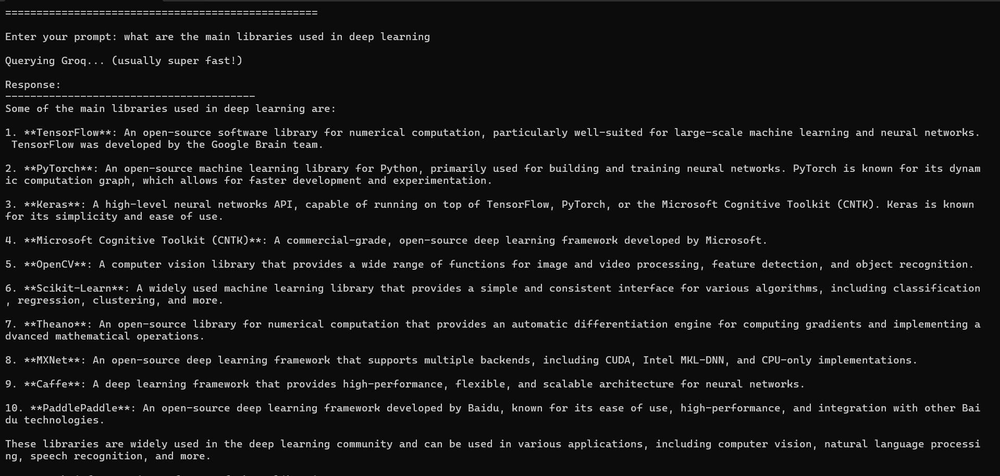
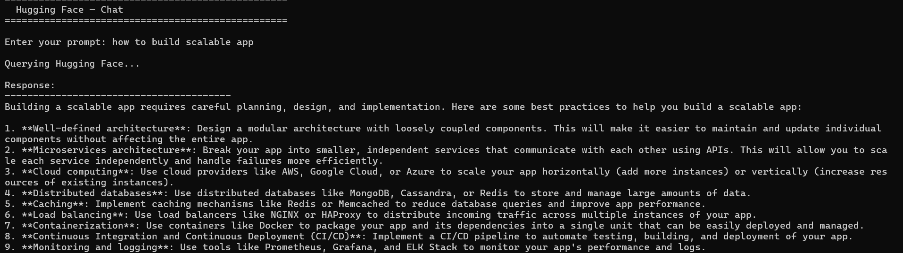
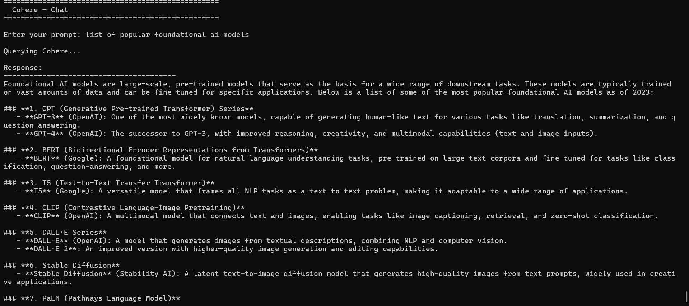

# AI API Integration

A Python project that connects to **5 different AI providers** — Groq, Ollama, Hugging Face, Google Gemini, and Cohere — through individual scripts and a unified multi-provider interface.

Built for the CampusPe Generative AI course assignment.

---

## Project Structure

```
ai-api-integration/
├── groq_example.py          # Groq — LLaMA 3 (cloud, very fast)
├── ollama_example.py        # Ollama — local models (no API key needed)
├── huggingface_example.py   # Hugging Face — Mistral 7B (cloud)
├── gemini_example.py        # Google Gemini 1.5 Flash (cloud)
├── cohere_example.py        # Cohere Command-R (cloud)
├── multi_api_query.py       # Bonus: CLI unified interface + side-by-side comparison
├── requirements.txt         # Python dependencies
├── .env                     # Your API keys (DO NOT commit this!)
├── .gitignore               # Keeps .env out of Git
└── screenshots/
    ├── groq.png
    ├── llama.png
    ├── hugging_face.png
    ├── gemini.png
    ├── cohere.png
    └── multi.png
```

---

## Setup Instructions

### 1. Clone the repository

```bash
git clone <your-repo-url>
cd ai-api-integration
```

### 2. Create a virtual environment (recommended)

```bash
python -m venv venv

# Activate it:
source venv/bin/activate        # macOS / Linux
venv\Scripts\activate           # Windows
```

### 3. Install dependencies

```bash
pip install -r requirements.txt
```

### 4. Add your API keys to `.env`

Open the `.env` file and fill in your keys:

```
GROQ_API_KEY=your_groq_key_here
HUGGINGFACE_API_KEY=your_hf_key_here
GOOGLE_API_KEY=your_google_key_here
COHERE_API_KEY=your_cohere_key_here
```

> **Never commit the `.env` file to GitHub.** It's already listed in `.gitignore` so this should happen automatically.

---

## How to Obtain Each API Key

| Provider          | Where to get the key                                                         | Free tier? |
| ----------------- | ---------------------------------------------------------------------------- | ---------- |
| **Groq**          | [console.groq.com](https://console.groq.com/) → API Keys                     | ✅ Yes     |
| **Hugging Face**  | [huggingface.co/settings/tokens](https://huggingface.co/settings/tokens)     | ✅ Yes     |
| **Google Gemini** | [makersuite.google.com/app/apikey](https://makersuite.google.com/app/apikey) | ✅ Yes     |
| **Cohere**        | [dashboard.cohere.com](https://dashboard.cohere.com/) → API Keys             | ✅ Yes     |
| **Ollama**        | No key needed — runs locally!                                                | ✅ Free    |

---

## How to Run Each Program

### Groq (LLaMA 3)

```bash
python groq_example.py
```

Queries Groq's hosted LLaMA 3 model. Usually responds in under a second.

**Output:**



---

### Ollama (Local — LLaMA 3)

```bash
# First, install Ollama from https://ollama.ai/
# Then pull a model (one-time download):
ollama pull llama3

# Run the script:
python ollama_example.py
```

Everything runs on your machine — no internet needed after the model is downloaded.

**Output:**


---

### Hugging Face

```bash
python huggingface_example.py
```

Queries Mistral-7B via the Hugging Face Inference API. The first request may take ~20 seconds while the model cold-starts (this is normal on the free tier).

**Output:**



---

### Google Gemini

```bash
python gemini_example.py
```

Queries Gemini 1.5 Flash — Google's fast, free-tier-friendly model.

**Output:**


---

### Cohere

```bash
python cohere_example.py
```

Queries Cohere's Command-R model.

**Output:**



---

### Multi-API Query (Bonus)

```bash
python multi_api_query.py
```

Choose any provider from a menu, or pick option **6** to query all providers simultaneously and compare their answers side-by-side.

**Output:**


---

## Notes

- API keys are loaded from the `.env` file using `python-dotenv` — they are never hardcoded.
- Each script includes error handling for common issues (invalid keys, rate limits, model loading).
- Ollama requires the Ollama app to be running locally before you call `ollama_example.py`.
- Hugging Face free tier models may take ~20 seconds to respond on the first call (cold start).

---

_CampusPe | Generative AI Assignment 2026_
